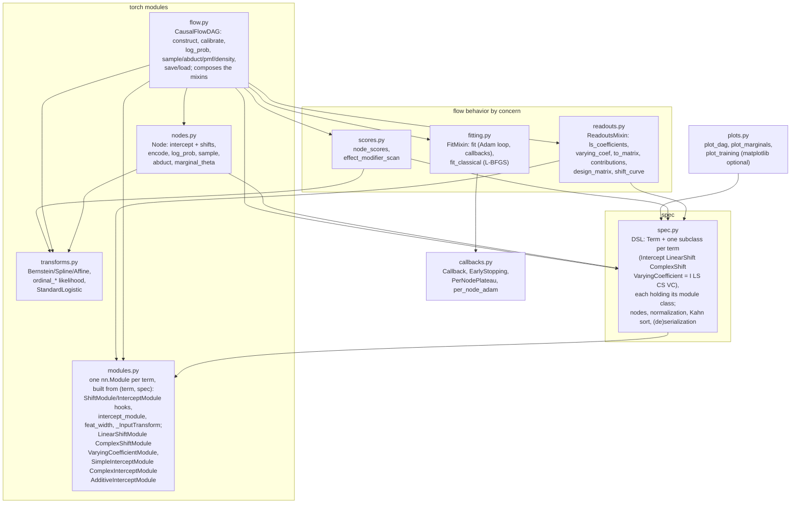
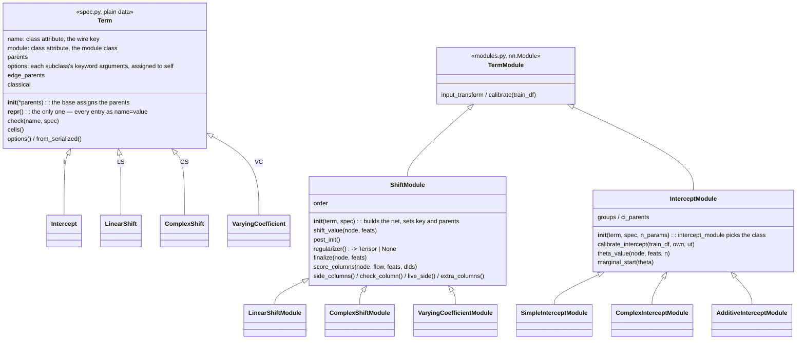
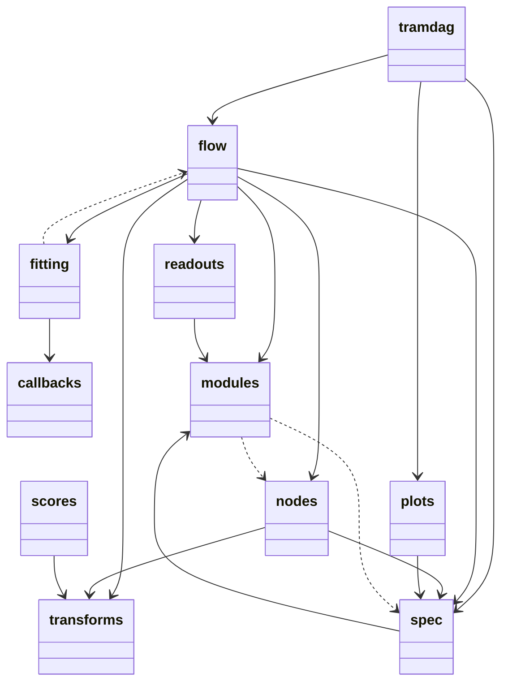
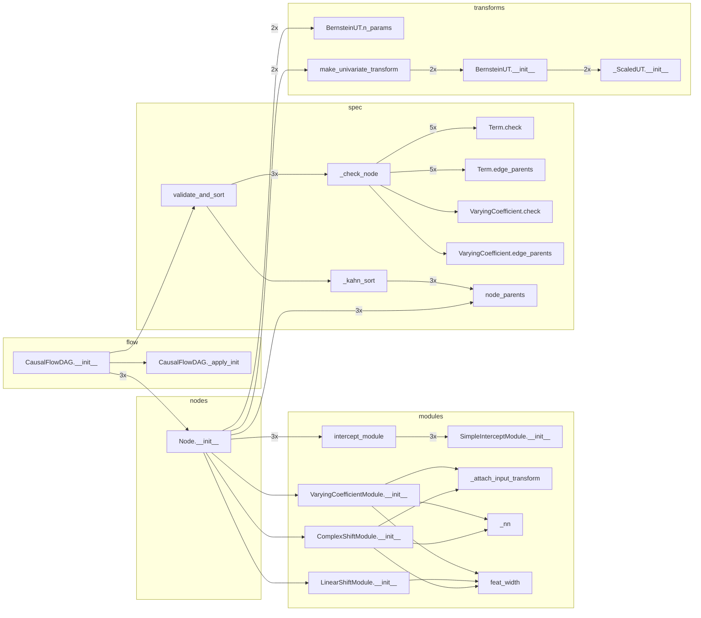
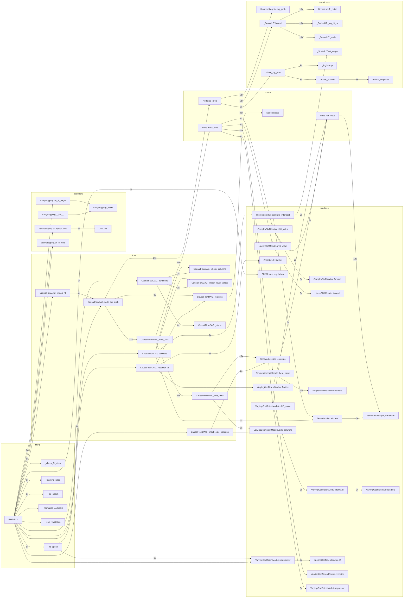

# Architecture

The package has ten modules and one rule. Term-specific behavior lives on the
term's two classes: its `Term` subclass (the spec) and its module in
`modules.py`. Node-kind behavior lives in five `Node` methods. Everything else
is framework code.

## Module map

`modules.py` imports nothing from `spec.py`: it reads a spec node's `kind` and
`levels` and a term's `parents` and options. That is what lets each term class
hold its module class directly (`LinearShift.module is LinearShiftModule`).
`fitting.py` and `readouts.py` are mixins that `CausalFlowDAG` composes;
`fitting` imports `flow` under `TYPE_CHECKING` only. The graph is acyclic.

## The term contract

Each module builds its layers in a fixed order under fixed attribute names, so
the state-dict paths (`nodes.<n>.shifts.<key>.…`) and the seeded RNG stream are
stable; `tests/test_statedict_stability.py` pins them.

A custom term is two classes:

- a `ShiftModule` subclass with `__init__(term, spec)`, which builds the
  network and sets `key` and `parents`, and `shift_value`;
- a `tramdag.Term` subclass with `name` and `module` as class attributes
  (`__init_subclass__` refuses one without). Its options are the keyword
  arguments of its `__init__`, assigned to `self` after
  `super().__init__(*parents)`; its rules are the checks after that, plus
  `check` and `edge_parents`.

## Node kinds

The two node kinds are continuous and ordinal. They stay an if/else in ONE
place: the five `Node` methods `log_prob`, `sample`, `abduct`,
`marginal_theta` and `encode` in nodes.py.

## Guards that pin all of this

- `tests/tools/statedict_smoke.py` — seeded per-DGP state dicts, bit-compared.
- The inline DGP truths (`tests/conftest.py`) and 45+ regex-pinned refusals.
- `experiments/ground_truth/*.json` — eight CI-checked replications with
  wall-time tripwires. Centers move only with a documented reason.

<!-- AUTOGEN:diagrams (tools/gen_diagrams.py) — do not edit by hand -->
## Generated views

To regenerate this section, run ``uv run python tools/gen_diagrams.py``.

The package UML and the class UML come from pyreverse. The class diagram
carries names and inheritance only. The call graphs come from a profile trace
of one flow construction and one three-epoch ``fit`` on a 3-node SI/LS/CS/VC
spec. The graphs keep tramdag-internal edges only, and ``3x`` means once per
node.

### Package UML (pyreverse)

### Class UML (pyreverse)

Each built-in term module holds its network and takes its contract from
``ShiftModule``/``InterceptModule``.

```mermaid
classDiagram
  class AdditiveInterceptModule {
  }
  class AffineUT {
  }
  class BernsteinUT {
  }
  class Callback {
  }
  class CausalFlowDAG {
  }
  class ComplexInterceptModule {
  }
  class ComplexShift {
  }
  class ComplexShiftModule {
  }
  class ContinuousNode {
  }
  class EarlyStopping {
  }
  class FitMixin {
  }
  class Intercept {
  }
  class InterceptModule {
  }
  class LinearShift {
  }
  class LinearShiftModule {
  }
  class Node {
  }
  class OrdinalNode {
  }
  class PerNodePlateau {
  }
  class ReadoutsMixin {
  }
  class ShiftModule {
  }
  class SimpleInterceptModule {
  }
  class SplineUT {
  }
  class StandardLogistic {
  }
  class Term {
  }
  class TermModule {
  }
  class VaryingCoefficient {
  }
  class VaryingCoefficientModule {
  }
  class _FnCallback {
  }
  class _InputTransform {
  }
  class _ScaledUT {
  }
  EarlyStopping --|> Callback
  PerNodePlateau --|> Callback
  _FnCallback --|> Callback
  CausalFlowDAG --|> FitMixin
  CausalFlowDAG --|> ReadoutsMixin
  AdditiveInterceptModule --|> InterceptModule
  ComplexInterceptModule --|> InterceptModule
  ComplexShiftModule --|> ShiftModule
  InterceptModule --|> TermModule
  LinearShiftModule --|> ShiftModule
  ShiftModule --|> TermModule
  SimpleInterceptModule --|> InterceptModule
  VaryingCoefficientModule --|> ShiftModule
  ComplexShift --|> Term
  Intercept --|> Term
  LinearShift --|> Term
  VaryingCoefficient --|> Term
  AffineUT --|> _ScaledUT
  BernsteinUT --|> _ScaledUT
  SplineUT --|> _ScaledUT
  ComplexShiftModule --o ComplexShift : module
  LinearShiftModule --o LinearShift : module
  VaryingCoefficientModule --o VaryingCoefficient : module
```

### Call graph — flow construction (traced)

### Call graph — one fit (traced)

<!-- AUTOGEN:end -->
