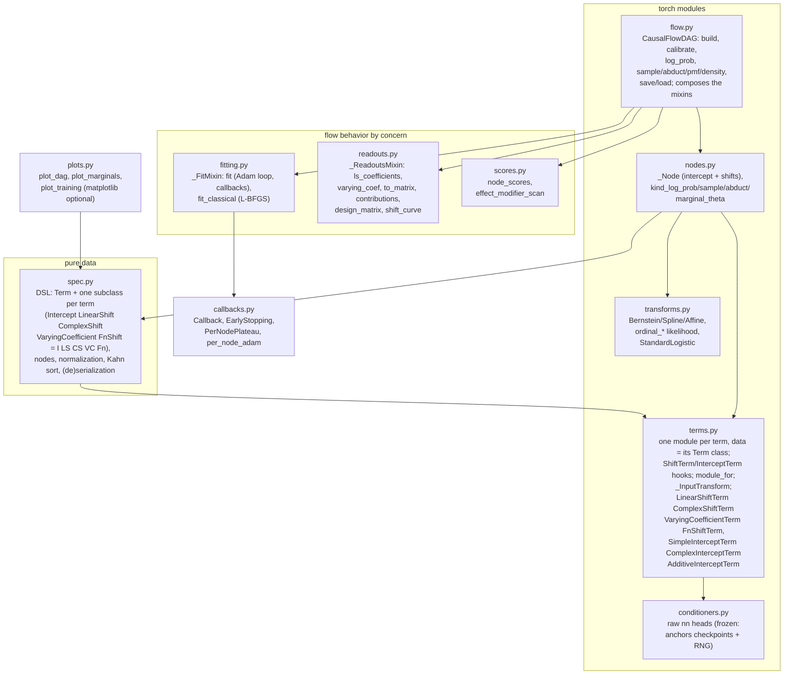
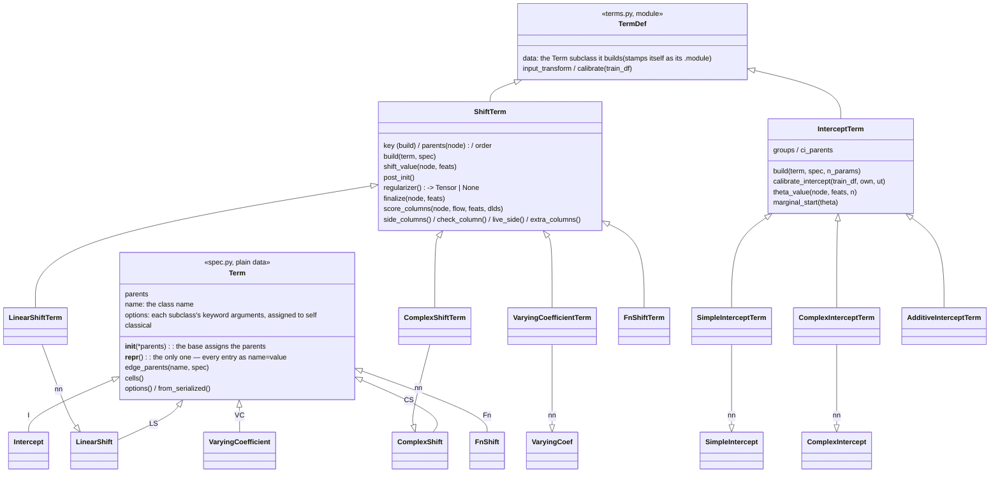
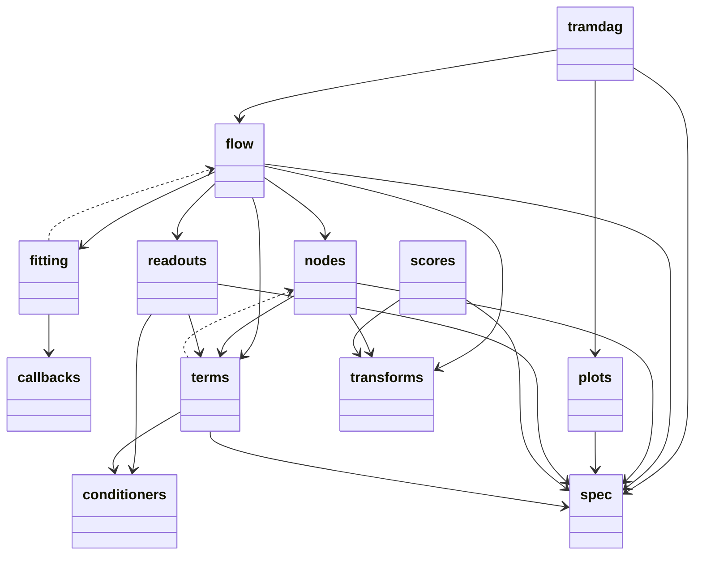
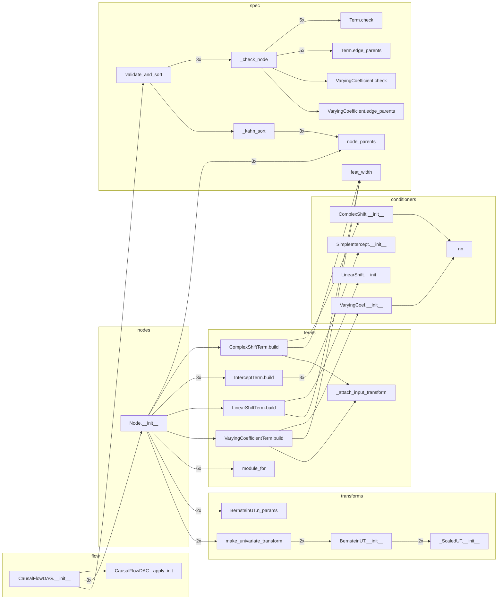
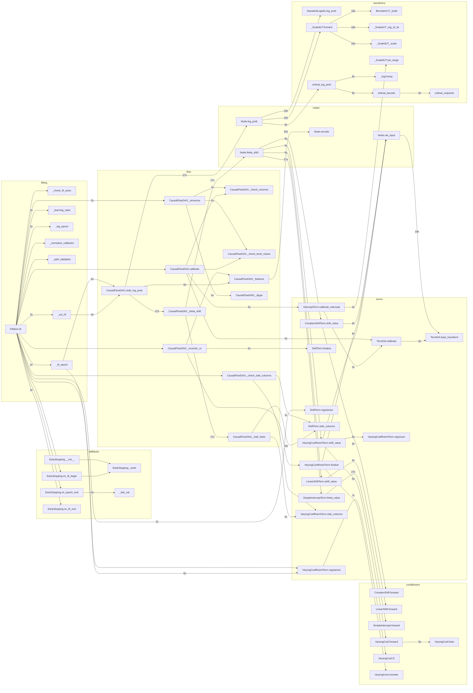

# Architecture

The package has eleven modules and one rule. Term-specific behavior lives on the
term's two classes. These are its `Term` subclass (the spec) and its module in
`terms.py`. Node-kind behavior lives in four adjacent functions. Everything
else is framework code.

[ADR 001](adr/001-term-owned-architecture.md) records these decisions and the
alternatives that the project refused.

## Module map

`spec.py` imports nothing from `terms.py`. Therefore the data layer stays
importable and torch runs no model code. `fitting.py` and `readouts.py` are
mixins that `CausalFlowDAG` composes. They import `flow` under
`TYPE_CHECKING` only. The graph is acyclic.

## The term contract

Built-in terms subclass their conditioners. Therefore the state-dict paths
(`nodes.<n>.shifts.<key>.…`) and the seeded RNG stream are those of 0.4.

A custom term is two classes:

- a `tramdag.Term` subclass. Its options are the keyword arguments of its
  `__init__`, assigned to `self` after `super().__init__(*parents)`; its rules
  are the checks after that, plus `edge_parents` and `cells`.
- a `ShiftTerm` subclass. It declares `data =` that class. It implements
  `build` and `shift_value`. The `build` method must set `key`.

Subclassing is the registration. For a one-off term, the cheap path is `Fn`.

## Node kinds

The two node kinds are continuous and ordinal. They stay an if/else in ONE
place. These four functions hold that if/else, adjacent in nodes.py:

- `kind_log_prob`
- `kind_sample`
- `kind_abduct`
- `kind_marginal_theta`

A third node kind is the trigger for a protocol. Until a third kind arrives,
the if/else stays.

## Guards that pin all of this

- `tests/tools/statedict_smoke.py` — seeded per-DGP state dicts, bit-compared.
- The inline DGP truths (`tests/conftest.py`) and 45+ regex-pinned refusals.
- `experiments/*/ground_truth/*.json` — ten CI-checked replications with
  wall-time tripwires. Centers move only with a documented reason.

<!-- AUTOGEN:diagrams (tools/gen_diagrams.py) — do not edit by hand -->
## Generated views

To regenerate this section, run ``uv run python tools/gen_diagrams.py``.

The package UML and the class UML come from pyreverse. The class diagram
carries names and inheritance only. The call graphs come from a profile trace
of one flow construction and one three-epoch ``fit`` on a 3-node SI/LS/CS/VC
spec. The graphs keep tramdag-internal edges only, and ``3x`` means once per
node.

### Package UML (pyreverse)

### Class UML (pyreverse)

The built-in terms are conditioners with a term-hook mixin: each concrete
term class inherits its network from ``conditioners`` and its contract
from ``ShiftTerm``/``InterceptTerm``.

```mermaid
classDiagram
  class AdditiveInterceptTerm {
  }
  class AffineUT {
  }
  class BernsteinUT {
  }
  class Callback {
  }
  class CausalFlowDAG {
  }
  class ComplexIntercept {
  }
  class ComplexInterceptTerm {
  }
  class ComplexShift {
  }
  class ComplexShift {
  }
  class ComplexShiftTerm {
  }
  class ContinuousNode {
  }
  class EarlyStopping {
  }
  class FitMixin {
  }
  class FnShift {
  }
  class FnShiftTerm {
  }
  class Intercept {
  }
  class InterceptTerm {
  }
  class LinearShift {
  }
  class LinearShift {
  }
  class LinearShiftTerm {
  }
  class Node {
  }
  class OrdinalNode {
  }
  class PerNodePlateau {
  }
  class ReadoutsMixin {
  }
  class ShiftTerm {
  }
  class SimpleIntercept {
  }
  class SimpleInterceptTerm {
  }
  class SplineUT {
  }
  class StandardLogistic {
  }
  class Term {
  }
  class TermDef {
  }
  class VaryingCoef {
  }
  class VaryingCoefficient {
  }
  class VaryingCoefficientTerm {
  }
  class _FnCallback {
  }
  class _InputTransform {
  }
  class _ScaledUT {
  }
  EarlyStopping --|> Callback
  PerNodePlateau --|> Callback
  _FnCallback --|> Callback
  CausalFlowDAG --|> FitMixin
  CausalFlowDAG --|> ReadoutsMixin
  ComplexShift --|> Term
  FnShift --|> Term
  Intercept --|> Term
  LinearShift --|> Term
  VaryingCoefficient --|> Term
  AdditiveInterceptTerm --|> InterceptTerm
  ComplexInterceptTerm --|> ComplexIntercept
  ComplexInterceptTerm --|> InterceptTerm
  ComplexShiftTerm --|> ComplexShift
  ComplexShiftTerm --|> ShiftTerm
  FnShiftTerm --|> ShiftTerm
  InterceptTerm --|> TermDef
  LinearShiftTerm --|> LinearShift
  LinearShiftTerm --|> ShiftTerm
  ShiftTerm --|> TermDef
  SimpleInterceptTerm --|> SimpleIntercept
  SimpleInterceptTerm --|> InterceptTerm
  VaryingCoefficientTerm --|> VaryingCoef
  VaryingCoefficientTerm --|> ShiftTerm
  AffineUT --|> _ScaledUT
  BernsteinUT --|> _ScaledUT
  SplineUT --|> _ScaledUT
  ComplexShift --o ComplexShiftTerm : data
  FnShift --o FnShiftTerm : data
  Intercept --o InterceptTerm : data
  LinearShift --o LinearShiftTerm : data
  VaryingCoefficient --o VaryingCoefficientTerm : data
```

### Call graph — flow construction (traced)

### Call graph — one fit (traced)

<!-- AUTOGEN:end -->
