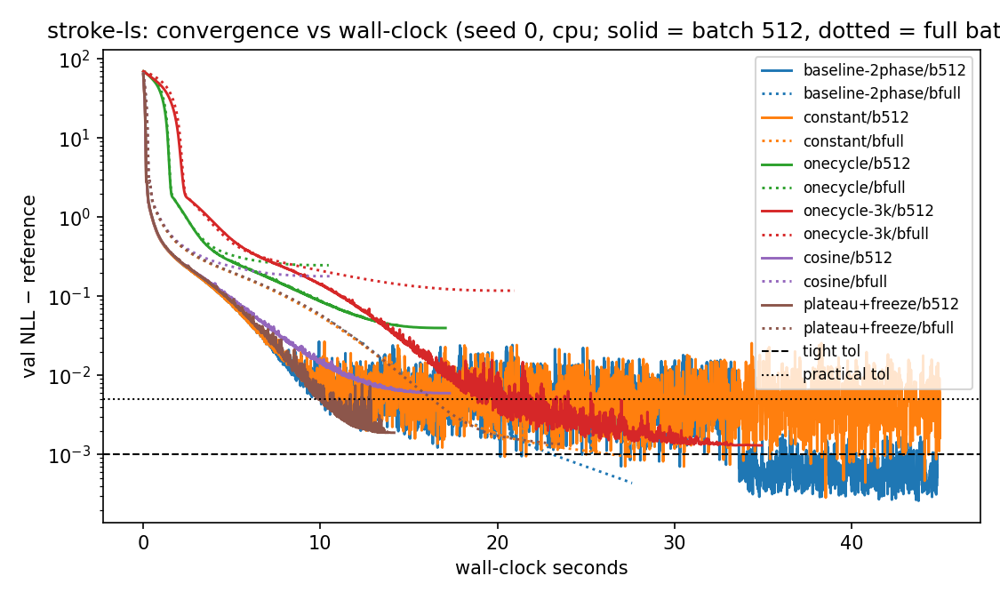
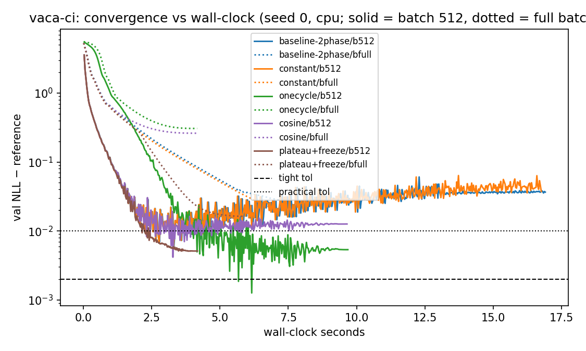

# How fast can a CausalFlowDAG train?

Benchmark of learning-rate schedules, per-node freezing, batch sizes, devices and
LBFGS — June 2026, Apple-silicon Mac mini, torch 2.12 (CPU unless noted).
Reproduce with `cd experiments && uv run python bench_training.py`
(grid ≈ 35 min; raw numbers in `results/bench-training/results.csv`).

## Method: time-to-target, not loss-go-down

Each config runs once; `fit()` records per-epoch validation NLL *and* wall-clock
time, so we read off the seconds until the fit is within a fixed gap of a cached
long-run reference (3 torch seeds, medians):

| workload | model / data | reference NLL | tight tol | practical tol |
|---|---|---|---|---|
| **stroke-ls** | all-`ls` stroke DAG, frozen `magic-mrclean/ls` (n=1275, full-data MLE) | 10.3042 (train) | +1e-3 | +5e-3 |
| **vaca-ci** | all-`ci` flow, frozen `vaca` (n=5000, 90/10 split) | 4.9632 (val) | +2e-3 | +1e-2 |

*Tight* ≈ exact-MLE equivalence (statsmodels/R-polr match). *Practical* ≈
coefficient-equivalent: a stroke fit with gap ≈ 3e-3 already matches the R
reference coefficients within the test tolerances
(`tests/test_fit_schedules.py::test_plateau_freeze_preserves_exact_mle`).

## Results




Median seconds to target (batch 512, cpu; "—" = never reached within budget):

| config | stroke-ls practical | stroke-ls tight | vaca-ci practical | vaca-ci tight | self-stops |
|---|---|---|---|---|---|
| baseline two-phase (old default) | 9.0 | **21.4** | 2.1 | 2.8¹ | no (runs 40 s / 15 s) |
| constant 1e-2 | 9.1 | 21.5² | 2.2 | 2.8¹ | no |
| onecycle (1500 / 300 ep) | — | — | 3.5 | 4.5 | no |
| onecycle (3000 ep) | 16.8 | — (gap 1–2e-3) | | | no |
| cosine | — | — | 2.2 | 3.5¹ | no |
| **plateau + freeze** | **8.9** | — (gap 2e-3) | **2.0** | 2.9 | **yes — 13 s / 4 s total** |
| LBFGS (full-batch) | **1.6** (2/3 seeds) | — (gap 4–8e-3) | n/a | n/a | yes |

¹ transient: the val-NLL curve dips through the target and then drifts away
(stroke: needs the 1e-3 phase to *stay*; vaca: mild overfitting). Final gap for
the vaca baseline is 0.037 — the old 520-epoch budget **underfits** vaca by
~0.03 nats. Plateau+freeze *stays* at its target.
² constant lr at batch 512 stalls at gap 3–7e-3; only the lr-decay phase closes
the last decade (that's exactly why the two-phase recipe existed).

## Findings

1. **Per-node plateau decay + freezing is the best default-style trainer.** Same
   time-to-accuracy as the hand-tuned two-phase schedule, but it needs **no
   budget tuning**, decays each node's lr off its own validation curve, freezes
   converged nodes (a real FLOP saving — the per-node NLLs have independent
   gradients), and **stops itself**: 13 s total vs the baseline's 40 s on
   stroke-ls, 4 s vs 15 s on vaca-ci, at equal or better final NLL.
2. **LBFGS is spectacular but not robust.** Full-batch LBFGS reaches
   coefficient-level accuracy on the classical all-`ls` model in **< 2 s**
   (vs 9 s for Adam) on 2/3 seeds; the third stalls at gap 8e-3. An Adam warm
   start made it *worse* (different basin), every seed. Use it as a fast
   first shot with the plateau trainer as fallback, not as the default.
3. **OneCycle is a "spend exactly this budget" scheduler.** Accuracy arrives
   only at the end of its anneal: at 1500 epochs it misses everything, at 3000
   it lands gap 1–2e-3 — but you must know the right budget in advance, which
   is the problem we're trying to remove.
4. **Full-batch loses on time-to-target** despite ~1.6× higher epoch
   throughput — too few optimizer steps per second of compute at these n.
   Batch 512 is a good default; very large batches (16k) only paid off in raw
   throughput at n=50k.
5. **MPS (Apple GPU) is 3–4× slower than the M-series CPU** at these model
   sizes (verified correct: identical reconstruction). Kernel-launch overhead
   dominates sub-millisecond ops. Stay on CPU locally; CUDA on Colab-class GPUs
   is a different regime (see the demo notebook's GPU-vs-CPU race).
6. **The old defaults waste or under-spend.** Stroke: 4000 epochs budgeted,
   converged work done after ~1500 (freezing recovers the difference
   automatically). Vaca: 520 epochs budgeted, ~0.03 nats short of converged.
   Fixed budgets are wrong in both directions; adaptive stopping fixes both.

## Recommendation

For everyday fits:

```python
flow.fit(train, val, epochs=4000, learning_rate=1e-2, batch_size=512,
         schedule="plateau", plateau_patience=30, freeze_patience=120)
```

(generous `epochs` as a ceiling — the fit stops itself). For exact classical
comparisons where the last 1e-3 matters, append a short constant-lr polish
phase (`epochs=500, learning_rate=1e-3`) after the plateau fit, or run the old
two-phase recipe.

We deliberately did **not** change `fit()`/`run_experiment` defaults in this PR
(default changes are their own reviewed decision — see the `restore_best`
episode in CHANGELOG.md). If this report convinces us, flipping
`experiments/common.py::run_experiment` to the plateau recipe is a 3-line
follow-up.
