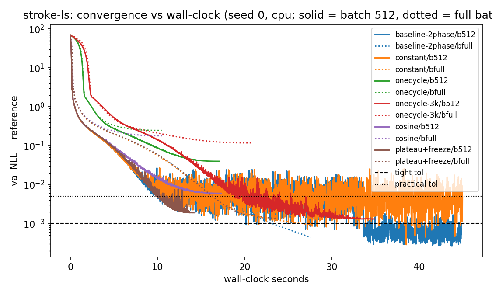
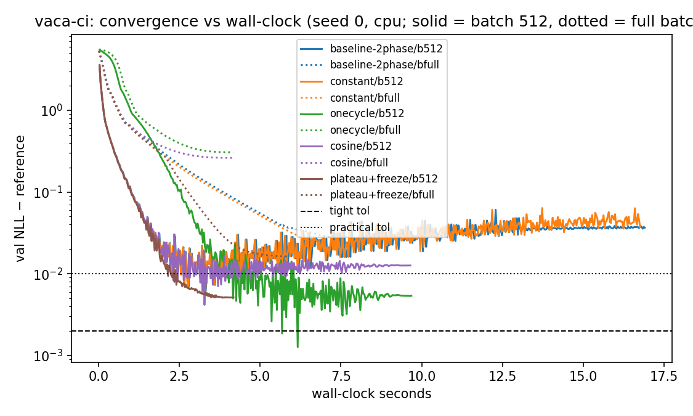

# How fast can a CausalFlowDAG train?

This document benchmarks five things:

- learning-rate schedules
- per-node freezing
- batch sizes
- devices
- LBFGS

The benchmark ran in June 2026 on an Apple-silicon Mac mini with torch 2.12. It
ran on the CPU, unless a row notes another device.

To reproduce the benchmark, run
[`experiments/benchmarks/bench_training.py`](../experiments/benchmarks/bench_training.py).
The command is `cd experiments && uv run python -m benchmarks.bench_training`.
For one seed on cpu, add `--quick`. The full grid takes ≈ 35 min.

For a quick **cross-machine** comparison, use the self-contained
[`experiments/benchmarks/perf_machine.py`](../experiments/benchmarks/perf_machine.py).
It runs fixed 200-epoch workloads on all available devices. It writes a machine
fingerprint to JSON. It needs nothing but `pip install tramdag`. The raw CSV is
a local run artifact, and it stays out of the repository.

## The recipes, and where they live now

Since 0.4, the recipes that this benchmark compares are **callbacks**. They are
training strategies, and they are not part of the model.
[fitting.md](fitting.md#training-strategies) says what each recipe is and gives
one line of code per recipe. The worked version of every recipe is in
[`notebooks/training_strategies.py`](../notebooks/training_strategies.py). This
page is only the measurement.

One behaviour matters here, because the numbers below turn on it.
`PerNodePlateau` watches each node's own validation score. When that score does
not improve by `min_delta` for `patience` epochs, the callback multiplies the
node's rate by `factor`, which is 0.3 by default. The floor is 1e-3 of the
start rate. After the rate has decayed 100x and then stays flat for `freeze`
epochs, the node leaves training at rate 0. The `min_delta` default is 1e-4,
and the stroke run in this benchmark uses 1e-5.

This behaviour is valid, because the per-node losses have independent
gradients. It lets the fit delete whole epochs, and not only shorten them.

The third recipe in the table below is a global plateau rule, which is one
shared rate rather than one rate per node. That is torch's
`ReduceLROnPlateau` on the summed validation NLL, and it is the rule the paper
reference uses. `experiments/paper/helpers.py::fit_paper` drives it.

`"onecycle"` and `"cosine"` lost to `"plateau"` on every workload. Version 0.4
removed them. Their measured rows below stay as the record.

**The exact-MLE path**: an exact comparison with the classical methods needs no
recipe. The classical methods are `statsmodels` and R `polr`/`tram`. Two plain
`fit` calls at decreasing rates reach the exact MLE.
`experiments/misc/validate_ls.py` runs a three-phase variant with 800/700/500
epochs at 1e-2/1e-3/1e-4 and batch 256. In 2026-09 this repository cut that
budget from 4000/2000/1000. The cut gives the same MLE, a named-coefficient gap
to statsmodels of 1.6e-5 against 1.8e-5, and about 3.5x less wall clock.

`fit` keeps the final weights. The guard test
`tests/test_fit_hooks.py::test_torch_plateau_scheduler_preserves_exact_mle`
shows that a schedule through the hooks still lands the all-`ls` fit on the
classical MLE within the usual tolerances.

**LBFGS** ships as its own method, [`fit_classical`](fitting.md). It supersedes
the hand-rolled recipe that this report benchmarked. The float32 variant
measured here was fast (< 2 s) but seed-fragile (Finding #2). The float64
upcast in `fit_classical` fixed that.

## Method: time-to-target, not loss-go-down

Each config runs once. The benchmark's callback records the per-epoch
validation NLL *and* the wall-clock time. From these records, we measure the
seconds until the fit is within a fixed gap of a cached long-run reference. The
reference is the median over 3 torch seeds of a long run. The two workloads and
their tolerances are:

| workload | model / data | reference NLL | tight tol | practical tol |
|---|---|---|---|---|
| **stroke-ls** | all-`ls` 5-node DAG, frozen `experiments/misc/data/magic-mrclean/ls` (n=1275, full-data MLE) | 10.3042 (train) | +1e-3 | +5e-3 |
| **vaca-ci** | all-`ci` flow, frozen `experiments/paper/data/vaca` (n=5000, 90/10 split) | 4.9632 (val) | +2e-3 | +1e-2 |

*Tight* ≈ exact-MLE equivalence, which is a statsmodels/R-polr match.
*Practical* ≈ coefficient-equivalent. A fit with gap ≈ 3e-3 already matches the
R reference coefficients within the tolerances of
[`experiments/misc/validate_ls.py`](../experiments/misc/validate_ls.py).

The workloads are unchanged since the measurement, with the same frozen data
and the same specs. A re-run therefore reproduces the machine-independent
stroke-ls reference NLL 10.3042 exactly.

## Results

The table shows the median seconds to target, at batch 512 on cpu. A "—" entry
means that the fit never reached the target within the budget.

| config | stroke-ls practical | stroke-ls tight | vaca-ci practical | vaca-ci tight | self-stops |
|---|---|---|---|---|---|
| baseline two-phase (old default) | 9.0 | **21.4** | 2.1 | 2.8¹ | no (runs 40 s / 15 s) |
| constant 1e-2 | 9.1 | 21.5³ | 2.2 | 2.8¹ | no |
| onecycle (1500 / 300 ep)² | — | — | 3.5 | 4.5 | no |
| onecycle (3000 ep)² | 16.8 | — (gap 1–2e-3) | | | no |
| cosine² | — | — | 2.2 | 3.5¹ | no |
| **plateau + freeze** | **8.9** | — (gap 2e-3) | **2.0** | 2.9 | **yes — 13 s / 4 s total** |
| LBFGS (full-batch) | **1.6** (2/3 seeds) | — (gap 4–8e-3) | n/a | n/a | yes |

¹ transient: the val-NLL curve dips through the target and then drifts away. Stroke needs
the 1e-3 phase to *stay*. Vaca shows mild overfitting. Final gap for the vaca baseline is
0.037. The old 520-epoch budget **underfits** vaca by ~0.03 nats. Plateau+freeze *stays*
at its target.
² Version 0.4 removed `onecycle` and `cosine` from `fit()`, because they lost
to plateau on every workload here. Nobody can re-measure these three rows.
³ constant lr at batch 512 stalls at gap 3–7e-3. Only the lr-decay phase closes the last
decade. This is why the two-phase recipe existed.

## Findings

1. **Per-node plateau decay + freezing is the best default-style trainer.** It
   reaches the same time-to-accuracy as the hand-tuned two-phase schedule. It
   needs **no budget tuning** to do so. It decays the lr of each node off that node's own
   validation curve. It freezes converged nodes, which is a real FLOP saving,
   because the per-node NLLs have independent gradients. And it **stops
   itself**. On stroke-ls it takes 13 s total against 40 s for the baseline. On
   vaca-ci it takes 4 s against 15 s, at an equal or better final NLL.
2. **LBFGS is fast but seed-fragile.** On 2/3 seeds, full-batch LBFGS reaches
   coefficient-level accuracy on the classical all-`ls` model in **< 2 s**. Adam
   needs 9 s for the same accuracy. The third seed stalls at gap 8e-3. An Adam
   warm start made it *worse* on every seed, because the fit then landed in a
   different basin. Use LBFGS as a fast first shot with the plateau trainer as
   the fallback, and not as the default.
3. **OneCycle is a "spend exactly this budget" scheduler.** Accuracy arrives
   only at the end of its anneal. At 1500 epochs it misses everything. At 3000
   epochs it lands gap 1–2e-3. But you must know the right budget in advance.
   That requirement is the problem that we try to remove.
4. **Full-batch loses on time-to-target**, despite ~1.6× higher epoch
   throughput. It makes too few optimizer steps per second of compute at these
   n. Batch 512 is a good default. Very large batches (16k) only improved raw
   throughput at n=50k.
5. **MPS (Apple GPU) is 3–4× slower than the M-series CPU** at these model
   sizes. The reconstruction is identical, so the MPS result is correct.
   Kernel-launch overhead dominates sub-millisecond ops. Stay on CPU locally.
   CUDA on Colab-class GPUs is a different regime.
6. **The old defaults waste or under-spend.** Stroke budgeted 4000 epochs, and
   the converged work is done after ~1500. Freezing recovers that difference
   automatically. Vaca budgeted 520 epochs, which is ~0.03 nats short of
   converged. Fixed budgets are wrong in both directions. Adaptive stopping
   fixes both.
7. **Freezing helps, and a parallel node loop does not.** Freezing deletes
   whole epochs. Node-level overlap only time-slices the cores that each node's
   batched BLAS operations already saturate. It measured as contention, not as
   speedup. Overlap can pay only where the per-node kernels do not fully use
   the hardware, which means tiny nodes on a large GPU. For that case the tool is a
   fusion of same-shaped nodes, not threads.

## Recommendation

The everyday recipe is the global-plateau callback in
[fitting.md](fitting.md#training-strategies), with a generous `epochs` ceiling.
The per-node self-stopping variant is `tramdag.callbacks.PerNodePlateau`.

One finding became a package default. `epochs` has no default, because Finding
6 shows that a fixed budget cannot be right for every workload. Every in-repo
caller states its recipe in its own YAML.
